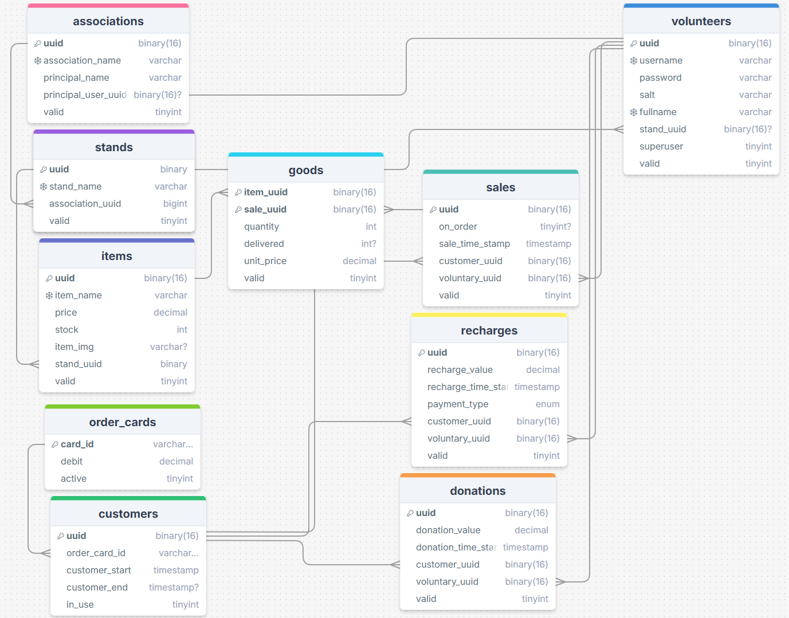

# Sales monitoring project

A project with the objective of controlling the sales and inventory of a fundraiser for a charity event

The following diagram summarizes the entities and relationships used as a basis to make a web page



### Depoy docker compose

To run the project it is necessary to use Docker and Docker Compose.
simply run the following command

```
$ docker compose up -d
```

the project will run 4 containers, namely:
 * Frontend
 * Backend
 * DB (mysql)
 * Proxy (nginx)

### Setup

After initialization it is necessary to configure the nginx-proxy-manager proxy,
configuration example https://www.youtube.com/watch?v=qlcVx-k-02E&t=639s

#### Setup database

Some commands can be used to start the database

```
$ docker exec store_control_backend_1 node ./codes/setup.js
```

This way the root and initial stands for cash control will be created

With this user it is possible to change the role of each user who registers in the system

the repository was used as a base: https://github.com/docker/awesome-compose