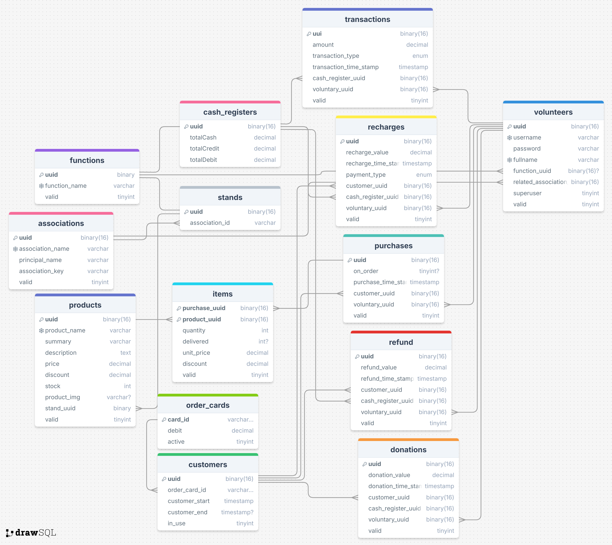

# Sales Monitoring Project

A project designed to control sales and inventory for a fundraiser in a charity event.

## Overview

This application is based on an Entity-Relationship Diagram that models the core entities and their relationships. Below is a summary of the architecture used for the project:

### Entity-Relationship Diagram and Implementation

The **Entity-Relationship Diagram** was created based on the **General Use Case Diagram** and served as the foundation for designing the database classes. These classes were implemented using an ORM (Object-Relational Mapping) framework, which maps application classes to database tables, ensuring seamless integration between the application and the database.

Additionally:

- The Use Case Diagrams guided the development of the frontend application, helping to align user interactions with the underlying data models and workflows.

### Use Case Diagrams

The backend includes use cases modeled in the following diagrams:

- General Use Case Diagram: Describes all interactions between users and the database, (first diagram)

- Event Type Use Case Diagram: Outlines three specific scenarios for managing events:
  

1. Basic (Only Stand):
   A single person manages sales, payments, and delivery of orders.
   Suitable for small-scale events with unified responsibilities.
2. Order Card (Festival do Japão):

- One agent, the Cashier, handles orders, payments, and issues a card to the customer.
- The customer takes the card to a Counter Attendant to retrieve their order.
  Ideal for events requiring faster order processing by splitting responsibilities.

3. Tokens (Order Card) (Festa Junina):

- A central cashier sells tokens (internal event currency).
  Customers use these tokens to purchase food or goods at various stands.
- This method simplifies payment handling during large-scale events.

### File Structure

The project's structure follows best practices, ensuring scalability and maintainability. Key directories include:

`frontend/`: Contains the React application.
`backend/`: Contains the Spring Boot backend service.
`db/`: Database initialization scripts.
`table_service/`: Contains the Python application for table extraction using computer vision.
`docker-compose.yml`: Configuration file for Docker Compose.

### Running the Project with Docker Compose

The project uses Docker and Docker Compose to simplify deployment and ensure a consistent environment. To run the application:

1. Ensure Docker and Docker Compose are installed on your machine.
2. Execute the following command in the project directory:
   `$ docker compose up -d`

This will start the application with 5 containers:

- Frontend: A web interface built with React (using Vite and TypeScript).
- Backend: A REST API built with Java (Spring Boot).
- MinIO: Local storage (simulate AWS storage)
- Database: MySQL for data storage.
- Table Service: A Python application designed for extracting tables from images
